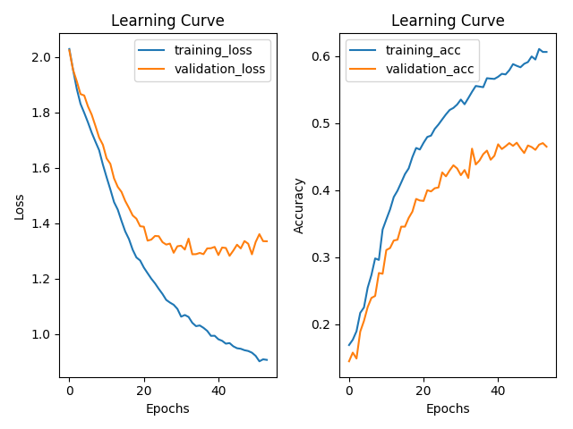
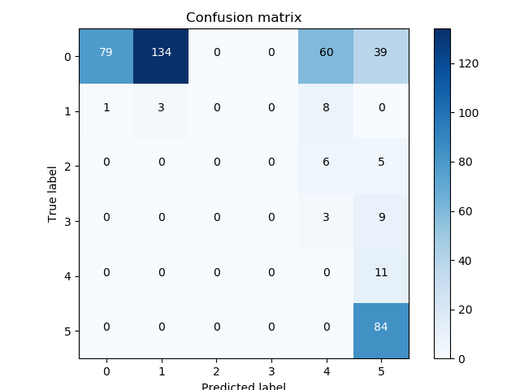
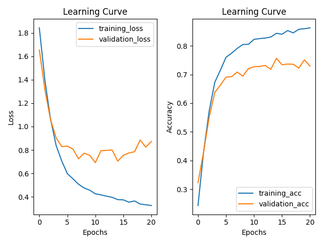
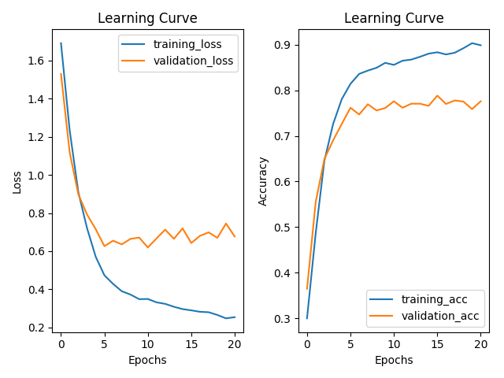

# Model1 - 單張直接偵測呵欠程度

## 流程
首先先切好 training 以及 testing set 的影片, 利用程式直接根據呵欠程度, 解出一張一張的 jpeg.
```
/AIA_Final_DrowsyDriverDetection$ python pic_gen_YawDD.py
```

然後利用 Keras 的 ImageDataGenerator 加上 generator 的 ``flow_from_directory`` 做呵欠程度 0, 1, 2, 3, 4, 5 的分類.
```
/AIA_Final_DrowsyDriverDetection$ python models.py
```

## 結果
硬分正確率不佳, 使用 ResNet 僅到 45% 左右.


由 confusion matrix 來看, 分錯的部份也不是分到相近的類別.


因此放棄此作法.


## Appendix
過程中不小心拿驗證標記的 video 來做為 training, 得到不錯的正確率.


